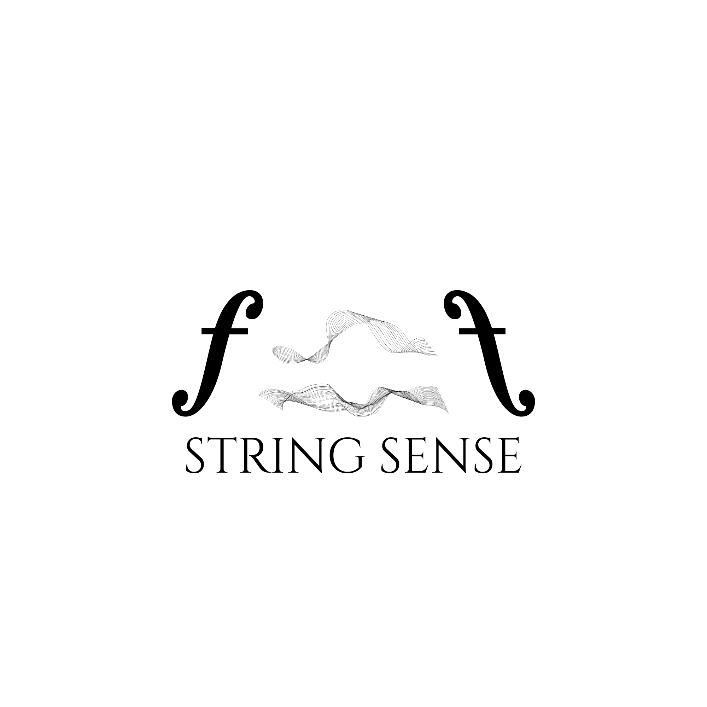

<p align="center">
  
</p>

<h3 align="center">An adaptive ear for the string player.</h3>

<p align="center">
  A precision piezo pickup and AI practice coach for violin, viola, and cello —<br>
  built to hear the difference between almost right and right.
</p>

<p align="center">
  <a href="https://stringsense.kr"></a>
  
</p>

<br>

## Stack

Static site — plain HTML, CSS, and JS, no build step. Hosted on GitHub Pages.

## Structure

```
index.html      site
assets/         logo and images
```